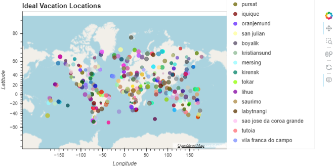

### python-api-challenge Module 6

# Notes 
This module demonstrates not only gitignore file usage, but API call, documentation, and subsequent dataframe building and interactive visualization creation in matplotlib and hvplot. Creating and reviewing for-loops, and defining plotting functions.  Personal work in developing and using difference types of virtual environments both in and out of conda env due to challenges in dependencies.  

## Part 1: WeatherPy
In this deliverable, you'll create a Python script to visualize the weather of over 500 cities of varying distances from the equator. You'll use the citipy Python libraryLinks to an external site., the OpenWeatherMap APILinks to an external site., and your problem-solving skills to create a representative model of weather across cities.

# Create Plots to Showcase the Relationship Between Weather Variables and Latitude
- Use the OpenWeatherMap API to retrieve weather data from the cities list generated in the started code
- Create a scatter plot to showcase the relationship between Latitude vs. Temperature

- Create a scatter plot to showcase the relationship between Latitude vs. Humidity

- Create a scatter plot to showcase the relationship between Latitude vs. Cloudiness

- Create a scatter plot to showcase the relationship between Latitude vs. Wind Speed

# Compute Linear Regression for Each Relationship
- Linear regression scatter plot for Northern Hemisphere: Temperature (F) vs. Latitude
- Linear regression scatter plot for Southern Hemisphere: Temperature (F) vs. Latitude
- Linear regression scatter plot for Northern Hemisphere: Humidity (%) vs. Latitude
- Linear regression scatter plot for Southern Hemisphere: Humidity (%) vs. Latitude 
- Linear regression scatter plot for Northern Hemisphere: Cloudiness (%) vs. Latitude 
- Linear regression scatter plot for Southern Hemisphere: Cloudiness (%) vs. Latitude 
- Linear regression scatter plot for Northern Hemisphere: Wind Speed (m/s) vs. Latitude 
- Linear regression scatter plot for Southern Hemisphere: Wind Speed (m/s) vs. Latitude 

# Part 2: VacationPy
In this deliverable, you'll use your weather data skills to plan future vacations. Also, you'll use Jupyter notebooks, the geoViews Python library, and the Geoapify API.

The code needed to import the required libraries and load the CSV file with the weather and coordinates data for each city created in Part 1 is provided to help you get started.

Your main tasks will be to use the Geoapify API and the geoViews Python library and employ your Python skills to create map visualizations.

- Create a map that displays a point for every city in the city_data_df DataFrame 
- Narrow down the city_data_df DataFrame to find your ideal weather condition

- For each city in the hotel_df DataFrame, use the Geoapify API to find the first hotel located within 10,000 metres of your coordinates
- Add the hotel name and the country as additional information in the hover message for each city in the map.

# Resources
Kourt Bailey(TA)- env variables + hvplots usage
Brittany Douville, Kevin Khan - help with defining cell 10-  VacationPy
EDX Bootcamps prompt used for README and startercode 

Sites reviewed 
- https://pypi.org/project/citipy/
- https://openweathermap.org/api
- https://apidocs.geoapify.com/docs/places/#about

OpenAI ChatGPT for review and help troubleshooting - cell 4- VacationPy
